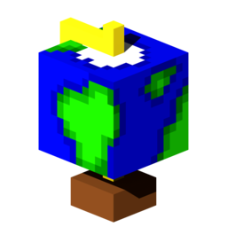
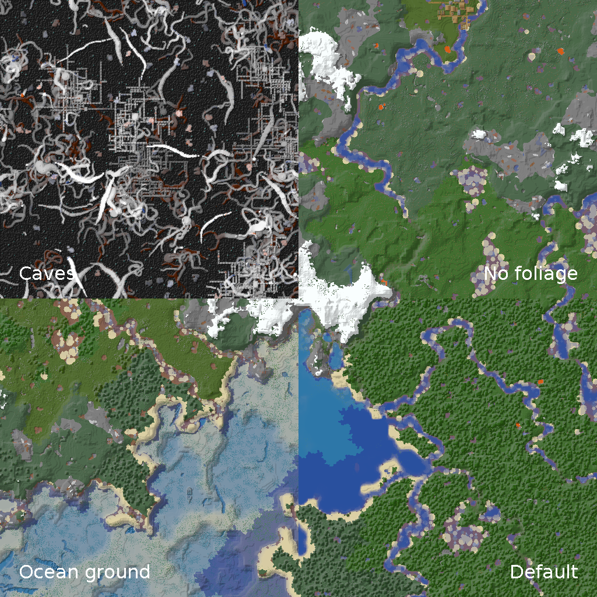
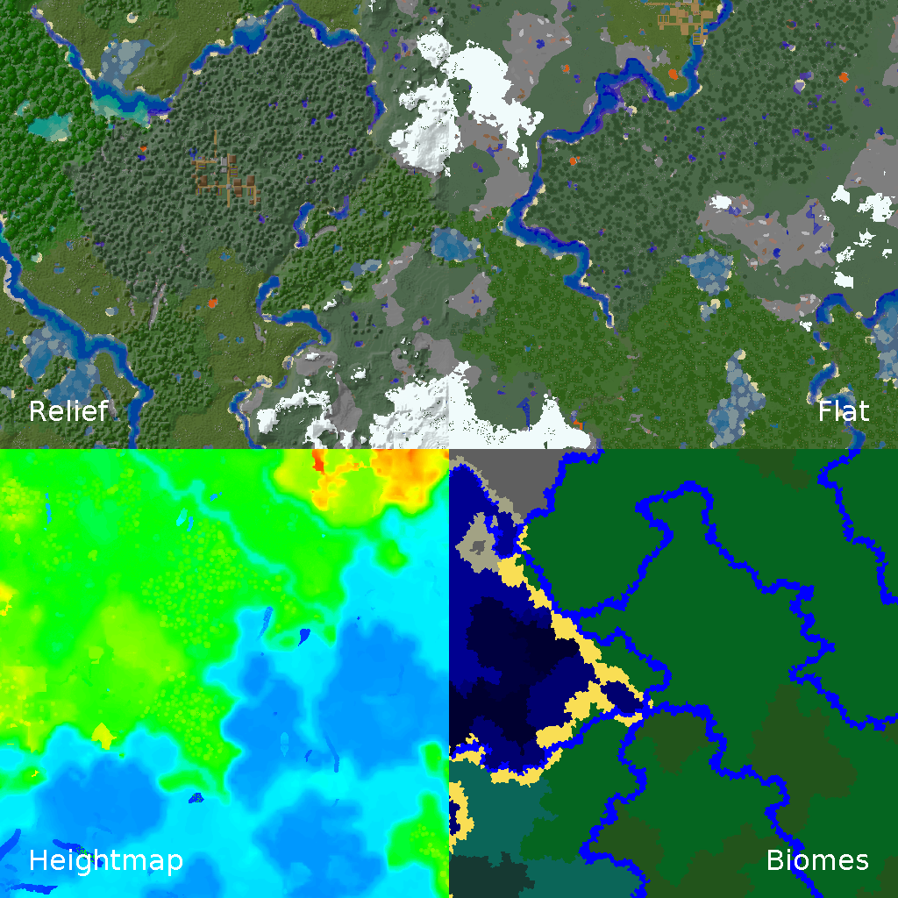
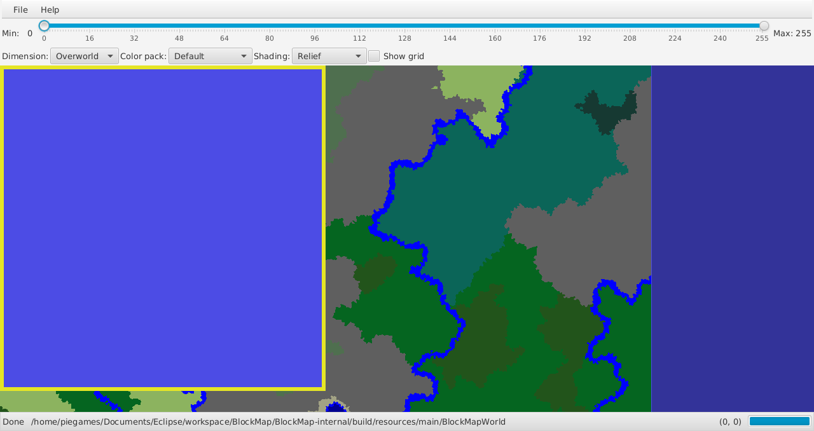
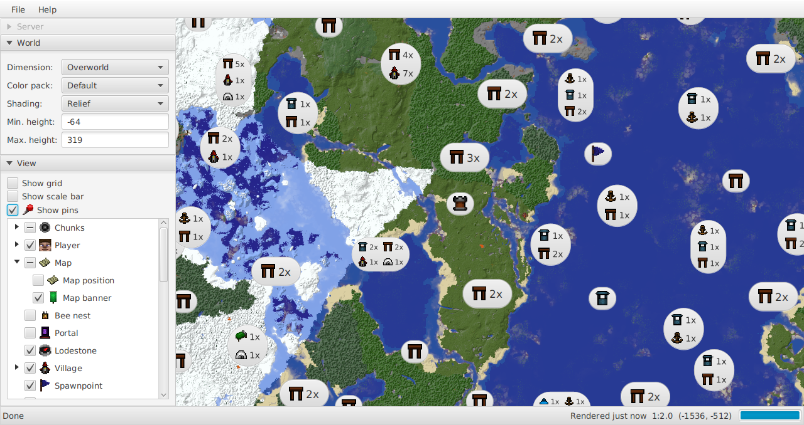

# BlockMap – A Minecraft 1.16 world viewer

[](https://github.com/Minecraft-Technik-Wiki/BlockMap/actions)



## Features:

- Beautiful, realistic renders
- Really fast (>700 chunks/s on my system)
- Works with huge worlds
- Works on servers
- Rendering scale: 1 pixel : 1 block
- An interactive GUI viewer made with JavaFX
- Pins on the map show points of interest like players, generated structures and villages
- Different color maps and shaders that highlight exactly what you are looking for (including an underground caves and an ocean ground view)
- A command line interface to render your worlds from scripts
- The core rendering code as library to use in your own projects (releasing soon™)
- Works with 1.16 worlds (with limited support down to 1.13)

## Gallery







## Requirements:

- Minecraft 1.13+ worlds. Chunks from before the release (even from 1.13 snapshots) will be ignored. Please optimize your worlds in Minecraft before rendering them (or use other map viewer, like [TMCMR](https://github.com/TOGoS/TMCMR)).
- Java 12+
	- While BlockMap should run on any Java, using the [OpenJDK](https://adoptopenjdk.net/) is recommended.
	- If you won't hack on the code itself, the JRE should suffice (in the downloads section, choose JRE over JDK)
	- Past experience has shown that Java updates are not as backwards-compatible as they could be. So while any newer Java version **should** work just fine, it has currently only been tested up to Java 14. If you encounter any problems that go away by downgrading Java, please open up an issue.

## Get it / Installation:

Download the latest version from the [Release page](https://github.com/piegamesde/BlockMap/releases).

### AUR package

Arch Linux users can install BlockMap directly from the [AUR](https://aur.archlinux.org/packages/blockmap-git/).

### Other distros

BlockMap hasn't been packaged for other distros yet (looking for maintainers).

## Use it (GUI):

The GUI version should just run by (double)clicking it. Otherwise run it through:

    java -jar BlockMap-gui-2.1.0.jar

to start. If you installed BlockMap through a package manager, search for it in your launcher or menu.

### GUI controls:

- Mouse wheel to zoom in and out
- Drag with the left mouse button to pan the view
  - ~~If you drag to the edge, the mouse will wrap around so you can drag indefinitely. Blender users will appreciate this~~
    - Currently broken, sorry
- When loading a world, you can select either a world folder, a region folder or a single region file
- You can only load remote worlds (from servers) if the server owner supports it.

## Use it (CLI):

If you want to use BlockMap through the command line without,

    # For general usage help
    java -jar BlockMap-cli-2.1.0.jar help
    # For help about rendering worlds to a folder
    java -jar BlockMap-cli-2.1.0.jar help render

will get you started. On Linux even with colors!

If your world has been created before the Minecraft 1.13 release, please optimize it. To do this, start Minecraft, select your world, go to "Edit" and then "Optimize World".

### Server usage:

*This feature is not stabilized yet. Backwards-incompatible changes may occur even on minor releases. Any feedback welcome.*

The new server mode is based around the following concept:

- Declare a configuration file with all your worlds and how you want to render them. An example configuration can be found [here](server-settings.json).
- Call `blockmap render-many` and pass the configuration file as argument. You can add dynamic server information like online plyers etc. via more command line options.
- An output directory will be created with all the rendered files. You can view them in BlockMap.
- Host that folder using the web server of your choice (e.g. [`miniserve`](https://github.com/svenstaro/miniserve)). Clients will now be able to view your worlds across the Internet.
- Call this on a scheduled basis. Subsequent runs will update the folder without re-rendering everything.

### Old server usage:

*The "old" way of doing server support: a simple shell script that calls the CLI.*

The bash script [server.sh](server.sh) is an example of how this could be used in a server environment. Simply set the paths at the top of the file and call this script regularly on the server. It has a few different render settings pre-configured, but they are easy to adapt to your needs.


## Build it:

Due to technical, legal and performance reasons, some resources required to run and test BlockMap are not included in this repository, but generated locally. The Gradle task `regenerate` will download all required files (you only need an internet connection the first time and after a `clean`) and generate and compile a bunch of stuff. Without this, nothing will work. On a freshly cloned repository, use `initEclipse` or `initIdea` to transform the repository into a project you can simply open in your favorite IDE. (Warning: The `eclipse` and `idea` tasks have to be called each time some dependencies changed. Furthermore, they link to some folders in the build directory. This means that they won't work as intended until `regenerate` has been called.)

All screenshots from above are generated automatically through the Gradle task `generateScreenshots`. This way, they are always up to date with the latest version. Be aware that this task needs to generate a fairly large Minecraft world first and then render it, which takes both time and space and will cause Gradle to slow down a lot.

## Run it:

To run from code:
```sh
./gradlew regenerate
# For the CLI
./gradlew :BlockMap-cli:run
# For the GUI
./gradlew :BlockMap-gui:run
```
If you want to create a release jar and run it, use `./gradlew :BlockMap-gui:runShadow` and `./gradlew :BlockMap-cli:runShadow`.

## Update and Release BlockMap:

```sh
./gradlew regenerate
./gradlew generateScreenshots # Optional
./gradlew release
```

- Bump the version in `build.gradle`
- Update `README.md`
	- Bump the version information in file paths
	- Bump the Minecraft version (if applicable)
	- Check the feature list and read through it
- Update the `changelog.md`
- Regenerate all resources
	- If something in the UI changed, regenerate the screenshots
- Generate the release binaries (need to be called on each target platform)
	- This will create two executable fat (=containing all needed dependencies) jars in `./BlockMap-{gui,cli}/build/libs/fat/`.
- Release on GitHub
- Update all packaged versions (currently only AUR)

## Update to newer Minecraft version

- Update and start Minecraft. Create a new debug world. Copy it to `./BlockMap-internal/src/test/resources`. Delete the `playerdata`, `stats` and `advancements` folders in it.
- Copy the current block color instructions in `./BlockMap-internal/src/main/resources/` to match the new Minecraft version.
- Copy the current `ChunkRenderer` in `de.piegames.blockmap.renderer` (in `BlockMap-core`) to match the new Minecraft version.
- Commit as `Minecraft $VERSION: Update preparation`
- Start off updating `de.piegames.blockmap.MinecraftVersion`
- Update the Minecraft version of `ChunkRenderer_$VERSION` in the constructor
- Update `de.piegames.blockmap.renderer.RegionRenderer` to use the new `ChunkRenderer`
- Run `./gradlew regenerate` and make it work
- Run all the tests and make them work
	- If Minecraft changed something on the save format, the `ChunkRenderer` will fail
	- If Minecraft added new blocks, the color map needs to be updated. The failing tests will tell which blocks are missing. Additional information can be retrieved from the default resource pack.
	- If Minecraft added or changed biomes, manual checking and updating is required
- Generate a Minecraft vanilla world and test the GUI
- Implement any new features of the update (e.g. new data that can be shown as GUI pin)
	- Don't forget `./BlockMap-internal/src/main/resources/biome-color-instructions.json`
- Regenerate the screenshots
	- Optimize the BlockMapWorld in Minecraft
	- `./gradlew clear && ./gradlew regenerate && ./gradlew generateScreenshots`
- Release it 🎉

## Troubleshooting

## Mod support:

Currently, no Minecraft mods are supported, but the rendering engine is built in an extensible way. Mod support will only be implemented on request.
